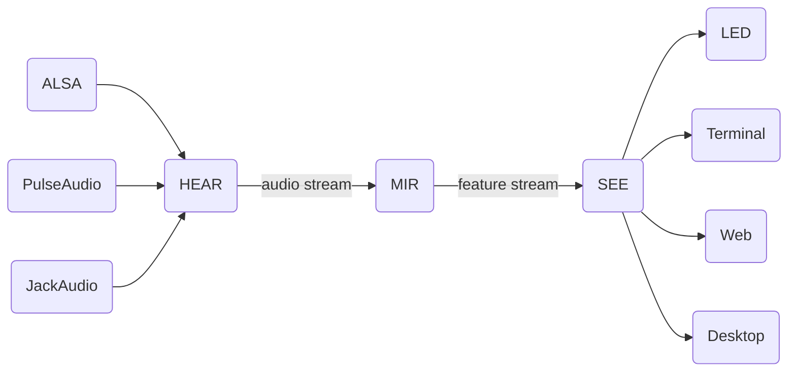

# What you SEE is what you HEAR. (所见即所听)

实时音乐可视化平台

* 高扩展性：可在多个不同视觉终端同步显示可视化内容

# 项目结构

* HEAR：获取设备上的音频，输出音频流。
* MIR：音乐信息检索算法合集，将输入的音频流转换为特征流。
* SEE：将特征流转化为可视化内容并显示到视觉终端

以上三个模块高度解耦，你可以用自己习惯的工具或语言实现并替换其中的任意一个。
